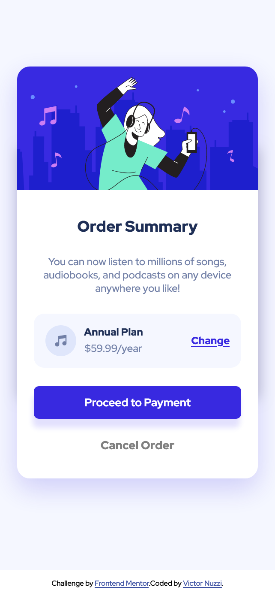

# 🛒 Order Summary Component

Repositório dedicado ao exercício ["Order Summary Component"](https://www.frontendmentor.io/challenges/order-summary-component-QlPmajDUj) do site [Frontend Mentor](https://www.frontendmentor.io).

## 🎯Desafio

"A perfect project for newbies who are starting to build confidence with layouts!"

*(Um projeto perfeito para os principiantes que estão a começar a ganhar confiança nos layouts!)*

### ⚒️ Tecnologias utilizadas 
- HTML5
- CSS3

### 🤩 Resultado

- [Confira aqui o resultado!](https://fem-vn-order-summary-component.netlify.app)

### 📸 Screenshots

  
Desktop:

  
  </img>
     

  
Mobile:

  
  </img>

